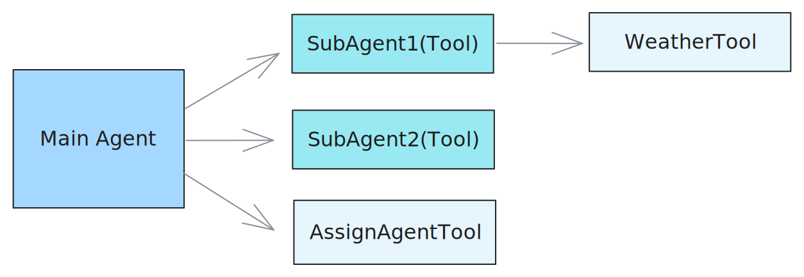

# AI

AstrBot 内置了对多种大语言模型（LLM）提供商的支持，并且提供了统一的接口，方便插件开发者调用各种 LLM 服务。

您可以使用 AstrBot 提供的 LLM / Agent 接口来实现自己的智能体。

我们在 `v4.5.7` 版本之后对 LLM 提供商的调用方式进行了较大调整，推荐使用新的调用方式。新的调用方式更加简洁，并且支持更多的功能。当然，您仍然可以使用[旧的调用方式](/dev/star/plugin#ai)。

## 获取当前会话使用的聊天模型 ID

> [!TIP]
> 在 v4.5.7 时加入

```py
umo = event.unified_msg_origin
provider_id = await self.context.get_current_chat_provider_id(umo=umo)
```

## 调用大模型

> [!TIP]
> 在 v4.5.7 时加入

```py
llm_resp = await self.context.llm_generate(
    chat_provider_id=provider_id, # 聊天模型 ID
    prompt="Hello, world!",
)
# print(llm_resp.completion_text) # 获取返回的文本
```

## 定义 Tool

Tool 是大语言模型调用外部工具的能力。

```py
from pydantic import Field
from pydantic.dataclasses import dataclass

from astrbot.core.agent.run_context import ContextWrapper
from astrbot.core.agent.tool import FunctionTool, ToolExecResult
from astrbot.core.astr_agent_context import AstrAgentContext


@dataclass
class BilibiliTool(FunctionTool[AstrAgentContext]):
    name: str = "bilibili_videos"  # 工具名称
    description: str = "A tool to fetch Bilibili videos."  # 工具描述
    parameters: dict = Field(
        default_factory=lambda: {
            "type": "object",
            "properties": {
                "keywords": {
                    "type": "string",
                    "description": "Keywords to search for Bilibili videos.",
                },
            },
            "required": ["keywords"],
        }
    )

    async def call(
        self, context: ContextWrapper[AstrAgentContext], **kwargs
    ) -> ToolExecResult:
        return "1. 视频标题：如何使用AstrBot\n视频链接：xxxxxx"
```

## 注册 Tool 到 AstrBot

在上面定义好 Tool 之后，如果你需要实现的功能是让用户在使用 AstrBot 进行对话时自动调用该 Tool，那么你需要在插件的 __init__ 方法中将 Tool 注册到 AstrBot 中：

```py
class MyPlugin(Star):
    def __init__(self, context: Context):
        super().__init__(context)
        # >= v4.5.1 使用：
        self.context.add_llm_tools(BilibiliTool(), SecondTool(), ...)

        # < v4.5.1 之前使用：
        tool_mgr = self.context.provider_manager.llm_tools
        tool_mgr.func_list.append(BilibiliTool())
```

### 通过装饰器定义 Tool 和注册 Tool

除了上述的通过 `@dataclass` 定义 Tool 的方式之外，你也可以使用装饰器的方式注册 tool 到 AstrBot。如果请务必按照以下格式编写一个工具（包括函数注释，AstrBot 会解析该函数注释，请务必将注释格式写对）

```py{3,4,5,6,7}
@filter.llm_tool(name="get_weather") # 如果 name 不填，将使用函数名
async def get_weather(self, event: AstrMessageEvent, location: str) -> MessageEventResult:
    '''获取天气信息。

    Args:
        location(string): 地点
    '''
    resp = self.get_weather_from_api(location)
    yield event.plain_result("天气信息: " + resp)
```

在 `location(string): 地点` 中，`location` 是参数名，`string` 是参数类型，`地点` 是参数描述。

支持的参数类型有 `string`, `number`, `object`, `boolean`, `array`。在 v4.5.7 之后，支持对 `array` 类型参数指定子类型，例如 `array[string]`。

## 调用 Agent

> [!TIP]
> 在 v4.5.7 时加入

Agent 可以被定义为 system_prompt + tools + llm 的结合体，可以实现更复杂的智能体行为。

在上面定义好 Tool 之后，可以通过以下方式调用 Agent：

```py
llm_resp = await self.context.tool_loop_agent(
    event=event,
    chat_provider_id=prov_id,
    prompt="搜索一下 bilibili 上关于 AstrBot 的相关视频。",
    tools=ToolSet([BilibiliTool()]),
    max_steps=30, # Agent 最大执行步骤
    tool_call_timeout=60, # 工具调用超时时间
)
# print(llm_resp.completion_text) # 获取返回的文本
```

`tool_loop_agent()` 方法会自动处理工具调用和大模型请求的循环，直到大模型不再调用工具或者达到最大步骤数为止。

## Multi-Agent

> [!TIP]
> 在 v4.5.7 时加入

Multi-Agent（多智能体）系统将复杂应用分解为多个专业化智能体，它们协同解决问题。不同于依赖单个智能体处理每一步，多智能体架构允许将更小、更专注的智能体组合成协调的工作流程。我们使用 `agent-as-tool` 模式来实现多智能体系统。

在下面的例子中，我们定义了一个主智能体（Main Agent），它负责根据用户查询将任务分配给不同的子智能体（Sub-Agents）。每个子智能体专注于特定任务，例如获取天气信息。



定义 Tools:

```py
from pydantic import Field
from pydantic.dataclasses import dataclass

from astrbot.core.agent.run_context import ContextWrapper
from astrbot.core.agent.tool import FunctionTool, ToolExecResult
from astrbot.core.astr_agent_context import AstrAgentContext

@dataclass
class AssignAgentTool(FunctionTool[AstrAgentContext]):
    """Main agent uses this tool to decide which sub-agent to delegate a task to."""

    name: str = "assign_agent"
    description: str = "Assign an agent to a task based on the given query"
    parameters: dict = Field(
        default_factory=lambda: {
            "type": "object",
            "properties": {
                "query": {
                    "type": "string",
                    "description": "The query to call the sub-agent with.",
                },
            },
            "required": ["query"],
        }
    )

    async def call(
        self, context: ContextWrapper[AstrAgentContext], **kwargs
    ) -> ToolExecResult:
        # Here you would implement the actual agent assignment logic.
        # For demonstration purposes, we'll return a dummy response.
        return "Based on the query, you should assign agent 1."


@dataclass
class WeatherTool(FunctionTool[AstrAgentContext]):
    """In this example, sub agent 1 uses this tool to get weather information."""

    name: str = "weather"
    description: str = "Get weather information for a location"
    parameters: dict = Field(
        default_factory=lambda: {
            "type": "object",
            "properties": {
                "city": {
                    "type": "string",
                    "description": "The city to get weather information for.",
                },
            },
            "required": ["city"],
        }
    )

    async def call(
        self, context: ContextWrapper[AstrAgentContext], **kwargs
    ) -> ToolExecResult:
        city = kwargs["city"]
        # Here you would implement the actual weather fetching logic.
        # For demonstration purposes, we'll return a dummy response.
        return f"The current weather in {city} is sunny with a temperature of 25°C."


@dataclass
class SubAgent1(FunctionTool[AstrAgentContext]):
    """Define a sub-agent as a function tool."""

    name: str = "subagent1_name"
    description: str = "subagent1_description"
    parameters: dict = Field(
        default_factory=lambda: {
            "type": "object",
            "properties": {
                "query": {
                    "type": "string",
                    "description": "The query to call the sub-agent with.",
                },
            },
            "required": ["query"],
        }
    )

    async def call(
        self, context: ContextWrapper[AstrAgentContext], **kwargs
    ) -> ToolExecResult:
        ctx = context.context.context
        event = context.context.event
        logger.info(f"the llm context messages: {context.messages}")
        llm_resp = await ctx.tool_loop_agent(
            event=event,
            chat_provider_id=await ctx.get_current_chat_provider_id(
                event.unified_msg_origin
            ),
            prompt=kwargs["query"],
            tools=ToolSet([WeatherTool()]),
            max_steps=30,
        )
        return llm_resp.completion_text


@dataclass
class SubAgent2(FunctionTool[AstrAgentContext]):
    """Define a sub-agent as a function tool."""

    name: str = "subagent2_name"
    description: str = "subagent2_description"
    parameters: dict = Field(
        default_factory=lambda: {
            "type": "object",
            "properties": {
                "query": {
                    "type": "string",
                    "description": "The query to call the sub-agent with.",
                },
            },
            "required": ["query"],
        }
    )

    async def call(
        self, context: ContextWrapper[AstrAgentContext], **kwargs
    ) -> ToolExecResult:
        return "I am useless :(, you shouldn't call me :("
```

然后，同样地，通过 `tool_loop_agent()` 方法调用 Agent：

```py
@filter.command("test")
async def test(self, event: AstrMessageEvent):
    umo = event.unified_msg_origin
    prov_id = await self.context.get_current_chat_provider_id(umo)
    llm_resp = await self.context.tool_loop_agent(
        event=event,
        chat_provider_id=prov_id,
        prompt="Test calling sub-agent for Beijing's weather information.",
        system_prompt=(
            "You are the main agent. Your task is to delegate tasks to sub-agents based on user queries."
            "Before delegating, use the 'assign_agent' tool to determine which sub-agent is best suited for the task."
        ),
        tools=ToolSet([SubAgent1(), SubAgent2(), AssignAgentTool()]),
        max_steps=30,
    )
    yield event.plain_result(llm_resp.completion_text)
```

## 对话管理器

### 获取会话当前的 LLM 对话历史 `get_conversation`

```py
from astrbot.core.conversation_mgr import Conversation

uid = event.unified_msg_origin
conv_mgr = self.context.conversation_manager
curr_cid = await conv_mgr.get_curr_conversation_id(uid)
conversation = await conv_mgr.get_conversation(uid, curr_cid)  # Conversation
```

::: details Conversation 类型定义

```py
@dataclass
class Conversation:
    """The conversation entity representing a chat session."""

    platform_id: str
    """The platform ID in AstrBot"""
    user_id: str
    """The user ID associated with the conversation."""
    cid: str
    """The conversation ID, in UUID format."""
    history: str = ""
    """The conversation history as a string."""
    title: str | None = ""
    """The title of the conversation. For now, it's only used in WebChat."""
    persona_id: str | None = ""
    """The persona ID associated with the conversation."""
    created_at: int = 0
    """The timestamp when the conversation was created."""
    updated_at: int = 0
    """The timestamp when the conversation was last updated."""
```

:::

### 快速添加 LLM 记录到对话 `add_message_pair`

```py
from astrbot.core.agent.message import (
    AssistantMessageSegment,
    UserMessageSegment,
    TextPart,
)

curr_cid = await conv_mgr.get_curr_conversation_id(event.unified_msg_origin)
user_msg = UserMessageSegment(content=[TextPart(text="hi")])
llm_resp = await self.context.llm_generate(
    chat_provider_id=provider_id, # 聊天模型 ID
    contexts=[user_msg], # 当未指定 prompt 时，使用 contexts 作为输入；同时指定 prompt 和 contexts 时，prompt 会被添加到 LLM 输入的最后
)
await conv_mgr.add_message_pair(
    cid=curr_cid,
    user_message=user_msg,
    assistant_message=AssistantMessageSegment(
        content=[TextPart(text=llm_resp.completion_text)]
    ),
)
```

### 主要方法

#### `new_conversation`

- __Usage__  
  在当前会话中新建一条对话，并自动切换为该对话。
- __Arguments__  
  - `unified_msg_origin: str` – 形如 `platform_name:message_type:session_id`  
  - `platform_id: str | None` – 平台标识，默认从 `unified_msg_origin` 解析  
  - `content: list[dict] | None` – 初始历史消息  
  - `title: str | None` – 对话标题  
  - `persona_id: str | None` – 绑定的 persona ID
- __Returns__  
  `str` – 新生成的 UUID 对话 ID

#### `switch_conversation`

- __Usage__  
  将会话切换到指定的对话。
- __Arguments__  
  - `unified_msg_origin: str`  
  - `conversation_id: str`
- __Returns__  
  `None`

#### `delete_conversation`

- __Usage__  
  删除会话中的某条对话；若 `conversation_id` 为 `None`，则删除当前对话。
- __Arguments__  
  - `unified_msg_origin: str`  
  - `conversation_id: str | None`
- __Returns__  
  `None`

#### `get_curr_conversation_id`

- __Usage__  
  获取当前会话正在使用的对话 ID。
- __Arguments__  
  - `unified_msg_origin: str`
- __Returns__  
  `str | None` – 当前对话 ID，不存在时返回 `None`

#### `get_conversation`

- __Usage__  
  获取指定对话的完整对象；若不存在且 `create_if_not_exists=True` 则自动创建。
- __Arguments__  
  - `unified_msg_origin: str`  
  - `conversation_id: str`  
  - `create_if_not_exists: bool = False`
- __Returns__  
  `Conversation | None`

#### `get_conversations`

- __Usage__  
  拉取用户或平台下的全部对话列表。
- __Arguments__  
  - `unified_msg_origin: str | None` – 为 `None` 时不过滤用户  
  - `platform_id: str | None`
- __Returns__  
  `List[Conversation]`

#### `update_conversation`

- __Usage__  
  更新对话的标题、历史记录或 persona_id。
- __Arguments__  
  - `unified_msg_origin: str`  
  - `conversation_id: str | None` – 为 `None` 时使用当前对话  
  - `history: list[dict] | None`  
  - `title: str | None`  
  - `persona_id: str | None`
- __Returns__  
  `None`

## 人格设定管理器

`PersonaManager` 负责统一加载、缓存并提供所有人格（Persona）的增删改查接口，同时兼容 AstrBot 4.x 之前的旧版人格格式（v3）。  
初始化时会自动从数据库读取全部人格，并生成一份 v3 兼容数据，供旧代码无缝使用。

```py
persona_mgr = self.context.persona_manager
```

### 主要方法

#### `get_persona`

- __Usage__
  获取根据人格 ID 获取人格数据。
- __Arguments__
  - `persona_id: str` – 人格 ID
- __Returns__
  `Persona` – 人格数据，若不存在则返回 None
- __Raises__
  `ValueError` – 当不存在时抛出

#### `get_all_personas`

- __Usage__  
  一次性获取数据库中所有人格。
- __Returns__  
  `list[Persona]` – 人格列表，可能为空

#### `create_persona`

- __Usage__  
  新建人格并立即写入数据库，成功后自动刷新本地缓存。
- __Arguments__  
  - `persona_id: str` – 新人格 ID（唯一）  
  - `system_prompt: str` – 系统提示词  
  - `begin_dialogs: list[str]` – 可选，开场对话（偶数条，user/assistant 交替）  
  - `tools: list[str]` – 可选，允许使用的工具列表；`None`=全部工具，`[]`=禁用全部
- __Returns__  
  `Persona` – 新建后的人格对象
- __Raises__  
  `ValueError` – 若 `persona_id` 已存在

#### `update_persona`

- __Usage__  
  更新现有人格的任意字段，并同步到数据库与缓存。
- __Arguments__  
  - `persona_id: str` – 待更新的人格 ID  
  - `system_prompt: str` – 可选，新的系统提示词  
  - `begin_dialogs: list[str]` – 可选，新的开场对话  
  - `tools: list[str]` – 可选，新的工具列表；语义同 `create_persona`
- __Returns__  
  `Persona` – 更新后的人格对象
- __Raises__  
  `ValueError` – 若 `persona_id` 不存在

#### `delete_persona`

- __Usage__  
  删除指定人格，同时清理数据库与缓存。
- __Arguments__  
  - `persona_id: str` – 待删除的人格 ID
- __Raises__  
  `Valueable` – 若 `persona_id` 不存在

#### `get_default_persona_v3`

- __Usage__  
  根据当前会话配置，获取应使用的默认人格（v3 格式）。  
  若配置未指定或指定的人格不存在，则回退到 `DEFAULT_PERSONALITY`。
- __Arguments__  
  - `umo: str | MessageSession | None` – 会话标识，用于读取用户级配置
- __Returns__  
  `Personality` – v3 格式的默认人格对象

::: details Persona / Personality 类型定义

```py

class Persona(SQLModel, table=True):
    """Persona is a set of instructions for LLMs to follow.

    It can be used to customize the behavior of LLMs.
    """

    __tablename__ = "personas"

    id: int = Field(primary_key=True, sa_column_kwargs={"autoincrement": True})
    persona_id: str = Field(max_length=255, nullable=False)
    system_prompt: str = Field(sa_type=Text, nullable=False)
    begin_dialogs: Optional[list] = Field(default=None, sa_type=JSON)
    """a list of strings, each representing a dialog to start with"""
    tools: Optional[list] = Field(default=None, sa_type=JSON)
    """None means use ALL tools for default, empty list means no tools, otherwise a list of tool names."""
    created_at: datetime = Field(default_factory=lambda: datetime.now(timezone.utc))
    updated_at: datetime = Field(
        default_factory=lambda: datetime.now(timezone.utc),
        sa_column_kwargs={"onupdate": datetime.now(timezone.utc)},
    )

    __table_args__ = (
        UniqueConstraint(
            "persona_id",
            name="uix_persona_id",
        ),
    )


class Personality(TypedDict):
    """LLM 人格类。

    在 v4.0.0 版本及之后，推荐使用上面的 Persona 类。并且， mood_imitation_dialogs 字段已被废弃。
    """

    prompt: str
    name: str
    begin_dialogs: list[str]
    mood_imitation_dialogs: list[str]
    """情感模拟对话预设。在 v4.0.0 版本及之后，已被废弃。"""
    tools: list[str] | None
    """工具列表。None 表示使用所有工具，空列表表示不使用任何工具"""
```

:::
