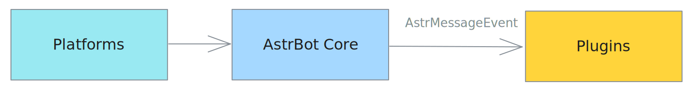
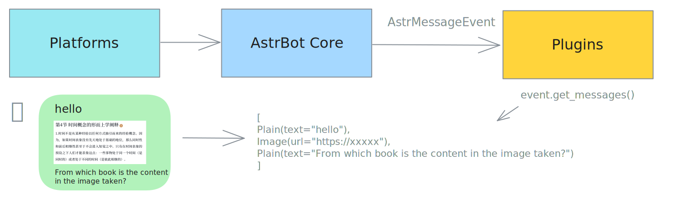
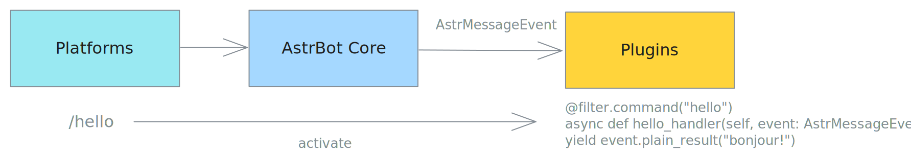
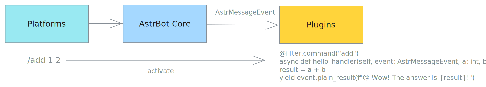

# 处理消息事件

事件监听器可以收到平台下发的消息内容，可以实现指令、指令组、事件监听等功能。

事件监听器的注册器在 `astrbot.api.event.filter` 下，需要先导入。请务必导入，否则会和 python 的高阶函数 filter 冲突。

```py
from astrbot.api.event import filter, AstrMessageEvent
```

## 消息与事件

AstrBot 接收消息平台下发的消息，并将其封装为 `AstrMessageEvent` 对象，传递给插件进行处理。



### 消息事件

`AstrMessageEvent` 是 AstrBot 的消息事件对象，其中存储了消息发送者、消息内容等信息。

### 消息对象

`AstrBotMessage` 是 AstrBot 的消息对象，其中存储了消息平台下发的消息具体内容，`AstrMessageEvent` 对象中包含一个 `message_obj` 属性用于获取该消息对象。

```py{11}
class AstrBotMessage:
    '''AstrBot 的消息对象'''
    type: MessageType  # 消息类型
    self_id: str  # 机器人的识别id
    session_id: str  # 会话id。取决于 unique_session 的设置。
    message_id: str  # 消息id
    group_id: str = "" # 群组id，如果为私聊，则为空
    sender: MessageMember  # 发送者
    message: List[BaseMessageComponent]  # 消息链。比如 [Plain("Hello"), At(qq=123456)]
    message_str: str  # 最直观的纯文本消息字符串，将消息链中的 Plain 消息（文本消息）连接起来
    raw_message: object
    timestamp: int  # 消息时间戳
```

其中，`raw_message` 是消息平台适配器的**原始消息对象**。

### 消息链



`消息链`描述一个消息的结构，是一个有序列表，列表中每一个元素称为`消息段`。

常见的消息段类型有：

- `Plain`：文本消息段
- `At`：提及消息段
- `Image`：图片消息段
- `Record`：语音消息段
- `Video`：视频消息段
- `File`：文件消息段

大多数消息平台都支持上面的消息段类型。

此外，OneBot v11 平台（QQ 个人号等）还支持以下较为常见的消息段类型：

- `Face`：表情消息段
- `Node`：合并转发消息中的一个节点
- `Nodes`：合并转发消息中的多个节点
- `Poke`：戳一戳消息段

在 AstrBot 中，消息链表示为 `List[BaseMessageComponent]` 类型的列表。

## 指令



```python
from astrbot.api.event import filter, AstrMessageEvent
from astrbot.api.star import Context, Star, register

@register("helloworld", "Soulter", "一个简单的 Hello World 插件", "1.0.0")
class MyPlugin(Star):
    def __init__(self, context: Context):
        super().__init__(context)

    @filter.command("helloworld") # from astrbot.api.event.filter import command
    async def helloworld(self, event: AstrMessageEvent):
        '''这是 hello world 指令'''
        user_name = event.get_sender_name()
        message_str = event.message_str # 获取消息的纯文本内容
        yield event.plain_result(f"Hello, {user_name}!")
```

> [!TIP]
> 指令不能带空格，否则 AstrBot 会将其解析到第二个参数。可以使用下面的指令组功能，或者也使用监听器自己解析消息内容。

## 带参指令



AstrBot 会自动帮你解析指令的参数。

```python
@filter.command("add")
def add(self, event: AstrMessageEvent, a: int, b: int):
    # /add 1 2 -> 结果是: 3
    yield event.plain_result(f"Wow! The anwser is {a + b}!")
```

## 指令组

指令组可以帮助你组织指令。

```python
@filter.command_group("math")
def math(self):
    pass

@math.command("add")
async def add(self, event: AstrMessageEvent, a: int, b: int):
    # /math add 1 2 -> 结果是: 3
    yield event.plain_result(f"结果是: {a + b}")

@math.command("sub")
async def sub(self, event: AstrMessageEvent, a: int, b: int):
    # /math sub 1 2 -> 结果是: -1
    yield event.plain_result(f"结果是: {a - b}")
```

指令组函数内不需要实现任何函数，请直接 `pass` 或者添加函数内注释。指令组的子指令使用 `指令组名.command` 来注册。

当用户没有输入子指令时，会报错并，并渲染出该指令组的树形结构。


理论上，指令组可以无限嵌套！

```py
'''
math
├── calc
│   ├── add (a(int),b(int),)
│   ├── sub (a(int),b(int),)
│   ├── help (无参数指令)
'''

@filter.command_group("math")
def math():
    pass

@math.group("calc") # 请注意，这里是 group，而不是 command_group
def calc():
    pass

@calc.command("add")
async def add(self, event: AstrMessageEvent, a: int, b: int):
    yield event.plain_result(f"结果是: {a + b}")

@calc.command("sub")
async def sub(self, event: AstrMessageEvent, a: int, b: int):
    yield event.plain_result(f"结果是: {a - b}")

@calc.command("help")
def calc_help(self, event: AstrMessageEvent):
    # /math calc help
    yield event.plain_result("这是一个计算器插件，拥有 add, sub 指令。")
```

## 指令别名

> v3.4.28 后

可以为指令或指令组添加不同的别名：

```python
@filter.command("help", alias={'帮助', 'helpme'})
def help(self, event: AstrMessageEvent):
    yield event.plain_result("这是一个计算器插件，拥有 add, sub 指令。")
```

### 事件类型过滤

#### 接收所有

这将接收所有的事件。

```python
@filter.event_message_type(filter.EventMessageType.ALL)
async def on_all_message(self, event: AstrMessageEvent):
    yield event.plain_result("收到了一条消息。")
```

#### 群聊和私聊

```python
@filter.event_message_type(filter.EventMessageType.PRIVATE_MESSAGE)
async def on_private_message(self, event: AstrMessageEvent):
    message_str = event.message_str # 获取消息的纯文本内容
    yield event.plain_result("收到了一条私聊消息。")
```

`EventMessageType` 是一个 `Enum` 类型，包含了所有的事件类型。当前的事件类型有 `PRIVATE_MESSAGE` 和 `GROUP_MESSAGE`。

#### 消息平台

```python
@filter.platform_adapter_type(filter.PlatformAdapterType.AIOCQHTTP | filter.PlatformAdapterType.QQOFFICIAL)
async def on_aiocqhttp(self, event: AstrMessageEvent):
    '''只接收 AIOCQHTTP 和 QQOFFICIAL 的消息'''
    yield event.plain_result("收到了一条信息")
```

当前版本下，`PlatformAdapterType` 有 `AIOCQHTTP`, `QQOFFICIAL`, `GEWECHAT`, `ALL`。

#### 管理员指令

```python
@filter.permission_type(filter.PermissionType.ADMIN)
@filter.command("test")
async def test(self, event: AstrMessageEvent):
    pass
```

仅管理员才能使用 `test` 指令。

### 多个过滤器

支持同时使用多个过滤器，只需要在函数上添加多个装饰器即可。过滤器使用 `AND` 逻辑。也就是说，只有所有的过滤器都通过了，才会执行函数。

```python
@filter.command("helloworld")
@filter.event_message_type(filter.EventMessageType.PRIVATE_MESSAGE)
async def helloworld(self, event: AstrMessageEvent):
    yield event.plain_result("你好！")
```

### 事件钩子

> [!TIP]
> 事件钩子不支持与上面的 @filter.command, @filter.command_group, @filter.event_message_type, @filter.platform_adapter_type, @filter.permission_type 一起使用。

#### Bot 初始化完成时

> v3.4.34 后

```python
from astrbot.api.event import filter, AstrMessageEvent

@filter.on_astrbot_loaded()
async def on_astrbot_loaded(self):
    print("AstrBot 初始化完成")

```

#### LLM 请求时

在 AstrBot 默认的执行流程中，在调用 LLM 前，会触发 `on_llm_request` 钩子。

可以获取到 `ProviderRequest` 对象，可以对其进行修改。

ProviderRequest 对象包含了 LLM 请求的所有信息，包括请求的文本、系统提示等。

```python
from astrbot.api.event import filter, AstrMessageEvent
from astrbot.api.provider import ProviderRequest

@filter.on_llm_request()
async def my_custom_hook_1(self, event: AstrMessageEvent, req: ProviderRequest): # 请注意有三个参数
    print(req) # 打印请求的文本
    req.system_prompt += "自定义 system_prompt"

```

> 这里不能使用 yield 来发送消息。如需发送，请直接使用 `event.send()` 方法。

#### LLM 请求完成时

在 LLM 请求完成后，会触发 `on_llm_response` 钩子。

可以获取到 `ProviderResponse` 对象，可以对其进行修改。

```python
from astrbot.api.event import filter, AstrMessageEvent
from astrbot.api.provider import LLMResponse

@filter.on_llm_response()
async def on_llm_resp(self, event: AstrMessageEvent, resp: LLMResponse): # 请注意有三个参数
    print(resp)
```

> 这里不能使用 yield 来发送消息。如需发送，请直接使用 `event.send()` 方法。

#### 发送消息前

在发送消息前，会触发 `on_decorating_result` 钩子。

可以在这里实现一些消息的装饰，比如转语音、转图片、加前缀等等

```python
from astrbot.api.event import filter, AstrMessageEvent

@filter.on_decorating_result()
async def on_decorating_result(self, event: AstrMessageEvent):
    result = event.get_result()
    chain = result.chain
    print(chain) # 打印消息链
    chain.append(Plain("!")) # 在消息链的最后添加一个感叹号
```

> 这里不能使用 yield 来发送消息。这个钩子只是用来装饰 event.get_result().chain 的。如需发送，请直接使用 `event.send()` 方法。

#### 发送消息后

在发送消息给消息平台后，会触发 `after_message_sent` 钩子。

```python
from astrbot.api.event import filter, AstrMessageEvent

@filter.after_message_sent()
async def after_message_sent(self, event: AstrMessageEvent):
    pass
```

> 这里不能使用 yield 来发送消息。如需发送，请直接使用 `event.send()` 方法。

### 优先级

指令、事件监听器、事件钩子可以设置优先级，先于其他指令、监听器、钩子执行。默认优先级是 `0`。

```python
@filter.command("helloworld", priority=1)
async def helloworld(self, event: AstrMessageEvent):
    yield event.plain_result("Hello!")
```

## 控制事件传播

```python{6}
@filter.command("check_ok")
async def check_ok(self, event: AstrMessageEvent):
    ok = self.check() # 自己的逻辑
    if not ok:
        yield event.plain_result("检查失败")
        event.stop_event() # 停止事件传播
```

当事件停止传播，后续所有步骤将不会被执行。

假设有一个插件 A，A 终止事件传播之后所有后续操作都不会执行，比如执行其它插件的 handler、请求 LLM。
